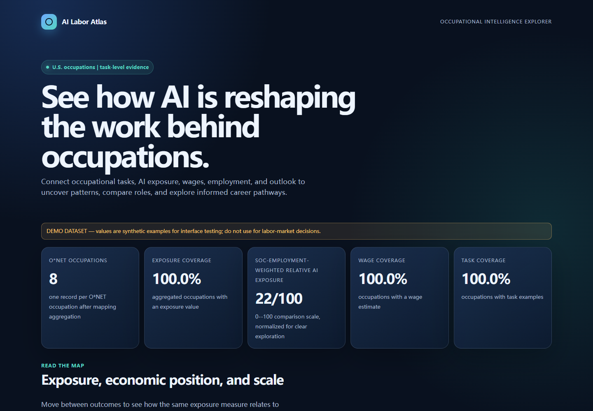
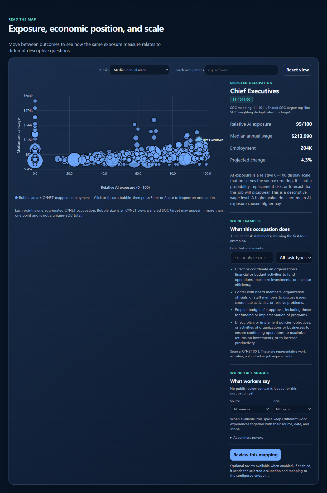
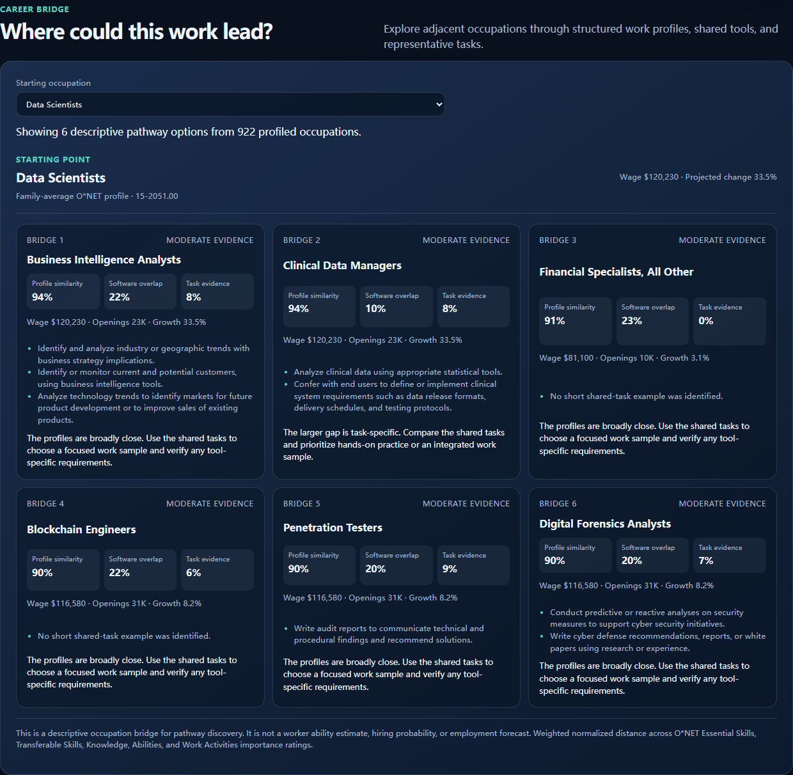

# AI Labor Atlas

AI Labor Atlas is a reproducible, descriptive measurement layer connecting occupations, tasks, AI exposure indicators, wages, and employment projections.

The current explorer focuses on U.S. national data, English-language sources, and descriptive rather than causal interpretation. It keeps the meaning and coverage of each measure clear so users can ask better questions about changing work.

## Quick start

```powershell
python -m venv .venv
.\.venv\Scripts\Activate.ps1
python -m pip install -e ".[excel]"
python -m ai_labor_atlas.cli build --demo
python -m ai_labor_atlas.cli analyze
python -m ai_labor_atlas.cli search analyst
python -m ai_labor_atlas.cli serve
```

The demonstration dataset is deterministic so the examples are easy to explore and reproduce. Research users can find the public source coverage and attribution notes in the sections below.

## Explore the dashboard

The dashboard connects occupational tasks, AI exposure, wages, employment, and projections in one visual view. Run the project locally to explore the interactive experience.







The dashboard compares AI exposure with wages, projected employment growth, annual openings, and employment scale. Exposure is a task-applicability indicator—not a probability of job loss—so the page explains the economic meaning and limits of each measure alongside the chart.

The Career bridge view helps users explore adjacent occupations. It uses structured O*NET importance ratings as the primary profile distance, then shows software overlap, supplemental task evidence, labor-market context, and a practical training hint. The bridge is a descriptive pathway tool. It is not a personal ability estimate, a hiring-probability model, or an employment forecast.

### Optional semantic review

The dashboard can send one selected occupation and its deterministic mapping to an OpenAI-compatible chat-completions endpoint for a second, text-based review. The review is advisory: it cannot change the dataset, exposure values, SOC codes, or summary measures. Leave the variables unset to keep the dashboard fully local and rule-based.

```powershell
$env:AI_LABOR_ATLAS_LLM_API_KEY = "your-key"
$env:AI_LABOR_ATLAS_LLM_BASE_URL = "https://api.openai.com/v1"
$env:AI_LABOR_ATLAS_LLM_MODEL = "your-model"
atlas serve
```

Candidate evidence is sent only when the review button is used. A local OpenAI-compatible endpoint may be used without an API key.

## Data sources and vintages

| Layer | Source | Version/vintage | Use |
| --- | --- | --- | --- |
| Occupation and tasks | O*NET | 30.3 | O*NET-SOC titles, descriptions, tasks, skills, software skills |
| Occupation bridge | O*NET crosswalk | 2019 -> 2018 SOC | Join O*NET occupations to BLS data |
| Wage | BLS OEWS | May 2025 | National employment and wage estimates |
| Outlook | BLS Employment Projections | 2024-2034 | Employment change and annual openings |
| AI exposure | AIOE | source release recorded in manifest | Descriptive exposure comparator |

O*NET-derived files must retain attribution to O*NET and the U.S. Department of Labor, Employment and Training Administration, and must identify modifications. AIOE raw redistribution is disabled by default until its repository license is verified.

The full local build uses the registered public files rather than the demo rows. The current validation snapshot contains 1,016 unique O*NET occupations and 18,796 source task statements across 923 occupations, with 79.0% exposure coverage, 94.1% wage coverage, and 94.6% employment coverage. Release summaries distinguish unique O*NET occupations, unique SOC codes, raw crosswalk-expanded rows, and the one-record-per-O*NET aggregation used for top-line coverage and means. The dashboard shows representative task statements for the selected occupation and supports keyword filtering within that task list. Missing source values remain missing in the output.

The occupation bridge uses O*NET 30.3 Essential Skills, Transferable Skills, Knowledge, Abilities, Work Activities, and Software Skills. Exact profiles are preferred; when a parent occupation has no direct structured rating, a family-average profile is marked in the result. This fallback is a data-coverage aid, not an exact occupational equivalence.

### What workers say

The occupation detail view includes an optional space for public worker comments about pay, interviews, management, workload, growth, and work environment. Comments keep their source, date, scope, and link where available. They are displayed as context rather than combined into an overall rating, and they never change the Atlas measures.

To load an auditable local import, create `data/processed/reviews.json` using the contract in [docs/review-data.md](docs/review-data.md). The demo does not invent worker comments. Review imports must respect the source platform's current terms, API rules, attribution requirements, privacy obligations, and user-content rights.

Before starting the dashboard, run the release check against an import file. It reports every row-level error and the resulting occupation, source, and topic coverage without printing review text:

```powershell
python -m ai_labor_atlas.cli validate-reviews --input data/processed/reviews.json
```

The dashboard remains fail-closed: a file that does not pass this check is not partially displayed.

Career Fit can connect to this context through the Atlas server. Set `CAREER_FIT_ATLAS_URL=http://127.0.0.1:8765` before starting Career Fit, then confirm the closest standard occupation in its optional occupation-context panel. Title suggestions are deliberately non-binding because a job title can map to several occupations.

Occupation suggestions use normalized title phrases and compatible role terms. If the supplied title is too broad or does not map cleanly to an Atlas title, the explorer returns no suggestion and asks the user to try a more specific title. This favors a transparent empty result over a plausible but misleading occupation.

For a small set of common nonstandard titles, the versioned [editorial candidate crosswalk](config/occupation_aliases_en.json) provides multiple possible occupation families. These are leads for user review, not official O*NET equivalences or automatic classifications; each candidate includes a mapping note and requires confirmation.

The research rationale and application boundaries are summarized in [the literature-to-product map](docs/literature-map.md).

The full `50 × 10 = 500` deterministic scenario audit, including data-quality, crosswalk, mapping, public-review, and dashboard checks, is documented in [the full audit report](docs/full-500-scenario-audit.md).

## What the numbers mean

`ai_exposure` is an exposure/applicability indicator, not a probability of job loss, a risk score, or evidence of causality. Wage and employment projections are joined by SOC code with provenance and coverage fields. Crosswalk-expanded rows are preserved with `crosswalk_weight`; multiple SOC targets are summarized only as disclosed weighted-reference estimates, with mapping quality flags retained. When no source allocation is available, `uniform_crosswalk_fallback` is shown. An unmapped occupation is labeled `missing_crosswalk` rather than being presented as a single-SOC observation. The release-level employment-weighted exposure uses each unique 2018 SOC target once, so shared SOC employment is not double-counted. A registered source hash mismatch is reported as `new_upstream_version_requires_review`; the downloader does not write the unverified payload.

## Repository map

- `src/ai_labor_atlas/`: loaders, joins, measures, CLI, and local dashboard
- `config/source_registry.json`: source URLs, versions, licenses, and redistribution status
- `docs/`: requirements, design, and data contract
- `tests/`: deterministic unit tests
